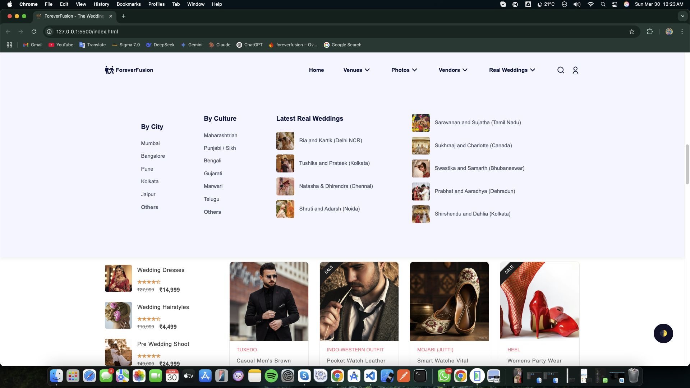

# ForeverFusion - Wedding Essentials Frontend  

Welcome to **ForeverFusion**, a premium wedding essentials platform where users can explore and shop for **bridal gowns, jewelry, footwear**, and more. Beyond shopping, **ForeverFusion** also connects users with essential wedding vendors like **photographers, makeup artists, decorators**, and other professionals to make wedding planning effortless.  

## Features  

- **Elegant UI/UX** inspired by modern wedding themes.  
- **Category-based Navigation** for easy browsing.  
- **Product Listings** including bridal gowns, jewelry, footwear, and more.  
- **Vendor Directory** for finding wedding service providers.  
- **Responsive Design** optimized for mobile and desktop.  

## Tech Stack  

- **HTML5**  
- **CSS3**  
- **JavaScript (Vanilla)**  

## Screenshots  

### Home Page  

### Gallery With Navbar

